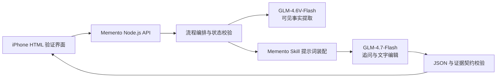

# Memento 智谱双模型 API 接入设计

- 日期：2026-07-29
- 状态：已确认，待书面评审
- 范围：HTML 验证版及其本地 Node.js 后端

## 1. 目标

在现有 Memento 文字编辑 Skill 基础上，完成一个可运行的纵向验证版本：

1. 用户在 iPhone 容器内上传一张图片并输入文字。
2. 系统从图片中提取可见事实。
3. 系统结合所有证据生成一个可跳过、可更换一次的追问。
4. 用户回答或选择“就这样收藏”后，系统生成整合后的正文、标题、来源和馆员评语。
5. 用户可以保留默认润色，或选择预设及自定义风格调整正文。

本次只验证文字编辑流程，不进行纪念卡渲染、图片生成、账号、云端存储、分享或支付开发。

## 2. 已确认的模型与边界

| 职责 | 模型 | 输入 | 输出 |
|---|---|---|---|
| 图片事实提取 | `glm-4.6v-flash` | 图片、约束提示词 | 可见事实 |
| 追问与文字编辑 | `glm-4.7-flash` | Skill 规则、流程状态、用户证据、可见事实 | Memento JSON |

`glm-4.7-flash` 是文本模型，不直接读取图片。`glm-4.6v-flash`
只负责形成 E2 可见证据，不推断人物身份、关系、动机、情绪或图片之外的事件。

两个模型使用同一个智谱开放平台 API Key，并调用统一的对话补全接口：

`POST https://open.bigmodel.cn/api/paas/v4/chat/completions`

参考：

- [GLM-4.7-Flash](https://docs.bigmodel.cn/cn/guide/models/free/glm-4.7-flash)
- [GLM-4.6V-Flash](https://docs.bigmodel.cn/cn/guide/models/free/glm-4.6v-flash)
- [对话补全 API](https://docs.bigmodel.cn/api-reference/%E6%A8%A1%E5%9E%8B-api/%E5%AF%B9%E8%AF%9D%E8%A1%A5%E5%85%A8)

## 3. 方案选择

### 方案 A：浏览器直接调用

实现最少，但 API Key 会暴露给所有访问者，不能用于公开产品。否决。

### 方案 B：一个视觉模型完成全部工作

调用链短，但图片观察、追问判断和文学编辑混在一起，不利于约束事实边界、
稳定输出和分别评估。暂不采用。

### 方案 C：Node.js 代理下的双模型流程

视觉模型只提取可见事实，文本模型负责完整的 Memento 编辑流程。后端隐藏
API Key、装配 Skill、维护状态并验证输出。该方案边界清晰，也便于未来将
HTML 前端替换为小程序，确定采用。

## 4. 总体架构



HTML 只与 Memento 后端通信，不接触模型地址和 API Key。未来的小程序可以
复用同一组后端接口与流程状态。

## 5. 组件设计

### 5.1 iPhone HTML 验证界面

验证界面使用固定手机外框和小程序安全区，内部页面按移动端宽度自适应。
包含以下状态：

1. 初始输入：图片选择、文字输入、提交。
2. 追问：只显示一个问题，以及“换一个问题”“就这样收藏”。
3. 默认成稿：显示标题、来源、正文、馆员评语，以及“就这样收藏”
   “调整风格”“自定义风格”。
4. 风格调整：选择预设或输入自然语言风格，更新正文。
5. 错误状态：保留用户输入并允许重试。

界面不渲染最终纪念卡，只展示文字字段与流程操作。

### 5.2 Node.js 服务

验证版使用 Node.js 20 及其内置 `fetch`，由同一进程提供静态 HTML 和 API。
浏览器将图片转为受限的 Base64 数据，通过 JSON 发送给后端，避免在验证版
引入上传存储。首版接受 JPEG、PNG 和 WebP，按解码前原文件限制为 10 MB；
不支持的格式在浏览器发送前提示用户转换。

后端承担：

- 输入大小、MIME 类型和流程状态校验；
- API Key 与模型配置读取；
- 图片事实提取；
- Skill 提示词装配；
- 模型调用、超时和有限重试；
- JSON 解析、契约校验及安全错误转换；
- 对浏览器隐藏上游响应、推理内容和密钥。

### 5.3 Skill 提示词装配

现有 `skills/memento-memory-editor` 是唯一的产品写作规则来源，不在服务代码里
复制第二套提示词。服务启动时读取并缓存：

- `SKILL.md`
- `references/contract.md`
- `references/evidence-policy.md`
- 当前模式需要的语气、追问、写作、风格或馆员参考文件

每次文本调用由以下部分组成：

1. 固定系统约束；
2. 当前模式需要的 Skill 内容；
3. `contract_version: "1.1"` 的流程输入；
4. E1 用户证据、E2 图片事实和 E4 风格要求；
5. 明确的 JSON 输出要求。

服务不向浏览器返回内部参考人物、私有风格路由、完整系统提示词或模型推理内容。

### 5.4 智谱 API 客户端

统一客户端负责：

- 请求头 `Authorization: Bearer ${BIGMODEL_API_KEY}`；
- 请求地址和模型名称配置；
- 默认非流式调用；
- 60 秒超时；
- 429、网络错误和 5xx 最多重试一次；
- 4xx 参数错误不重试；
- 提取 `choices[0].message.content`，忽略 `reasoning_content`。

文本调用设置 `response_format: {"type":"json_object"}`，同时在提示词中明确要求
JSON。视觉调用不依赖结构化输出参数，而是要求返回简短 JSON，并在本地解析和
校验；解析失败时只进行一次更严格的重试。

首版模型参数固定为：

- 文字：`thinking.type: "enabled"`、`temperature: 0.7`、
  `max_tokens: 4096`；
- 视觉：`thinking.type: "disabled"`、`temperature: 0.1`、
  `max_tokens: 1024`。

不同时设置 `temperature` 与 `top_p`。这些参数后续可以通过效果测试调整，但
不开放给浏览器控制。

首版不使用流式输出。这样可以先确保结构化结果和流程状态稳定，再决定是否为
正文生成增加流式体验。

## 6. 配置与密钥

本地配置：

```dotenv
BIGMODEL_API_KEY=
BIGMODEL_BASE_URL=https://open.bigmodel.cn/api/paas/v4
BIGMODEL_TEXT_MODEL=glm-4.7-flash
BIGMODEL_VISION_MODEL=glm-4.6v-flash
PORT=3000
```

仓库只提交空值的 `.env.example`。`.env` 必须加入 `.gitignore`，服务启动时若
缺少 `BIGMODEL_API_KEY`，应立即给出清楚错误。API Key 不出现在 HTML、请求
响应、日志、测试快照或 Git 历史中。

## 7. 接口与状态

验证版使用一个统一接口：

`POST /api/memento`

请求接受 Skill 的完整 `contract_version: "1.1"` 输入，并增加可选图片载荷。
下面是新建记忆时的常用请求；未展示的可选字段由服务按契约归一化：

```json
{
  "contract_version": "1.1",
  "mode": "auto",
  "image": {
    "mime_type": "image/jpeg",
    "data_base64": "..."
  },
  "visual_evidence": [],
  "raw_text": "用户最初输入",
  "follow_up_question": null,
  "follow_up_answer": "",
  "user_skipped": false,
  "question_state": {
    "asked": false,
    "replaced": false,
    "answered": false,
    "closed": false,
    "previous_intent": null
  },
  "style": null,
  "draft_state": {
    "base_draft_generated": false,
    "revision_state": "not_started",
    "selected_preset": null,
    "custom_style_request": null
  }
}
```

成功响应直接采用 Skill 契约中的用户安全字段。服务内部可附带请求 ID，但不
返回上游原始响应。

## 8. 数据流

### 8.1 新建记忆

1. 前端提交图片和文字。
2. 有图片且没有 `visual_evidence` 时，后端调用 `glm-4.6v-flash` 一次。
3. 后端将结果规范化为 E2 可见证据。
4. 后端调用 `glm-4.7-flash`，要求生成恰好一个追问。
5. 前端展示追问和两个操作。

即使初始素材已足够成文，新的记忆仍至少展示一个可跳过的系统追问。

### 8.2 回答、更换或跳过

- 用户回答：保留问题和答案，关闭追问预算，生成默认成稿。
- 用户“换一个问题”：最多允许一次；文本模型生成新问题，不重复识图。
- 用户“就这样收藏”：标记 `user_skipped: true`，直接生成默认成稿。

### 8.3 默认成稿与风格调整

默认成稿必须先展示整合后的版本，再询问是否调整。成稿包含：

- `title`
- `source_line`
- `summary`
- `story_text`
- `curator_note`

预设或自定义风格只改 `story_text`。没有新增事实时，不重复调用视觉模型；
`source_line` 和馆员路由也保持不变。用户确认保留当前版本时，不调用模型，只将
当前草稿标记为最终状态。

## 9. 输出校验

后端在返回前执行两层校验：

1. 结构校验：版本、状态、模式、必填字段、操作列表、来源长度和问题预算。
2. 语义防线：提示词要求事实绑定；服务拒绝引用不存在证据 ID 的绑定，并拒绝
   内部参考人物字段、空正文、多个追问或明显脱离证据的个人事实。

结构不合法时进行一次修复调用；仍不合法则返回可重试错误，不把半成品显示给
用户。仓库已有的 `validate_output.py` 继续作为测试期的确定性契约校验器。

## 10. 错误处理

前端统一接收：

```json
{
  "error": {
    "code": "UPSTREAM_TIMEOUT",
    "message": "这次整理没有完成，请稍后再试。",
    "retryable": true,
    "request_id": "..."
  }
}
```

错误代码至少覆盖：

- `CONFIG_MISSING`
- `INVALID_INPUT`
- `IMAGE_TOO_LARGE`
- `UNSUPPORTED_IMAGE_TYPE`
- `UPSTREAM_RATE_LIMITED`
- `UPSTREAM_TIMEOUT`
- `UPSTREAM_UNAVAILABLE`
- `MODEL_OUTPUT_INVALID`

用户输入与当前流程状态保留在前端，失败后可以原样重试。日志只记录请求 ID、
耗时、模型、状态码和错误代码，不记录 API Key、图片 Base64、完整私人文本或
模型推理内容。

## 11. 隐私与上线边界

验证版不持久化图片和文字。它们只在内存中完成一次请求处理，并会发送至智谱
模型服务。正式上线前需补充隐私政策、用户授权、内容安全、配额、滥用防护和
数据保留策略。

公开上线时仍必须保留后端代理，不能让小程序直接调用智谱 API。

## 12. 测试

### 自动测试

- API 客户端：认证头、模型选择、超时、重试和错误转换。
- 视觉提取：只接受 E2 可见事实，拒绝无效 JSON。
- 流程状态：首次必问、更换一次、跳过、回答、默认成稿、风格调整、最终确认。
- 契约：所有模型样例通过 `validate_output.py`。
- 安全：静态 HTML、日志与提交文件中不存在 API Key。

自动测试使用模拟上游响应，不消耗真实 API。

### 手动联调

在开发者自行配置 `.env` 后进行最小真实冒烟测试：

1. 纯文字新建记忆；
2. 图片加文字新建记忆；
3. 回答追问后生成默认成稿；
4. 自定义风格改写；
5. 模拟超时与无效密钥。

真实测试只报告成功、失败和请求 ID，不输出密钥。

## 13. 验收标准

1. API Key 未出现在浏览器源码、浏览器发往 Memento 后端的请求或 Git 中。
2. `glm-4.6v-flash` 只在需要首次识图时调用。
3. 所有追问和文字创作均由 `glm-4.7-flash` 完成。
4. 每个新记忆出现恰好一个可跳过追问，并最多更换一次。
5. 回答或跳过后能生成符合 Skill 1.1 契约的默认成稿。
6. 默认成稿先于风格选择出现，自定义风格可用。
7. 结果包含简短艺术化来源和一句鲜明、证据受限的馆员评语。
8. HTML 在 iPhone 容器中可完整走通流程，不渲染纪念卡。
9. 上游失败不会丢失用户输入，并提供可理解的重试提示。
10. 模拟测试全部通过；配置密钥后，五项真实冒烟测试可执行。
